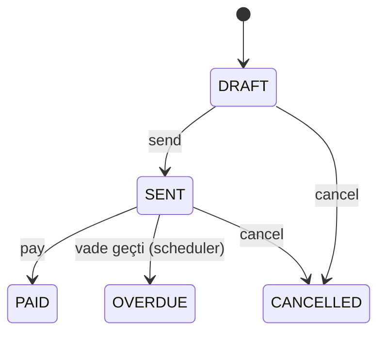

# Invoice Automation Service

**Fatura yaşam döngüsü otomasyonu** — taslak oluşturma, gönderim, ödeme ve vadesi geçen faturaların zamanlanmış kontrolü. Mali işler / tahsilat süreçlerinde tekrarlayan işleri azaltmak için tasarlanmış Spring Boot servisi.

> **Geliştirici:** Yusuf Berat Bozkurt — Ondokuz Mayıs Üniversitesi Bilgisayar Programcılığı  
> **GitHub:** [yusufberatbozkurt8](https://github.com/yusufberatbozkurt8)

---

## Özellikler

- Fatura durum makinesi: `DRAFT` → `SENT` → `PAID` / `OVERDUE` / `CANCELLED`
- Manuel tetiklenebilir vade kontrolü (`POST /automation/overdue-check`)
- Günlük cron ile otomatik `OVERDUE` işaretleme (`@Scheduled`)
- Benzersiz fatura numarası doğrulama
- Swagger UI + H2 demo verisi

## Teknolojiler

Java 17 · Spring Boot 3.2 · Spring Data JPA · Spring Scheduling · H2 · springdoc OpenAPI

## Kurulum

```bash
git clone https://github.com/yusufberatbozkurt8/invoice-automation-service.git
cd invoice-automation-service
mvn spring-boot:run
```

- API: `http://localhost:8082`
- Swagger: `http://localhost:8082/swagger-ui.html`

## API Örnekleri

```http
POST /api/v1/invoices
{
  "invoiceNumber": "INV-2026-100",
  "customerName": "Örnek A.Ş.",
  "amount": 12500.00,
  "issueDate": "2026-06-01",
  "dueDate": "2026-06-15"
}
```

```http
POST /api/v1/invoices/1/send
POST /api/v1/invoices/1/pay
POST /api/v1/invoices/automation/overdue-check
```

## Otomasyon akışı



Cron ifadesi `application.yml` içinde yapılandırılır (`invoice.automation.overdue-check-cron`).

## Test

```bash
mvn test
```

## Güvenlik

- Tüm `/api/**` uçları `X-API-Key` ile korunur (otomasyon uçları dahil).
- Fatura numarası formatı ve tutar doğrulaması; vade ≥ düzenleme tarihi kuralı.
- H2 Console kapalı; Swagger yalnızca `dev` profilinde.
- Beklenmeyen hatalarda genel mesaj döner (bilgi sızıntısı önlenir).

```http
POST /api/v1/invoices/1/send
X-API-Key: dev-only-change-me
```

## Genişletme fikirleri

- E-posta bildirimi (Spring Mail)
- PDF fatura üretimi (iText / OpenPDF)
- PostgreSQL + çok kiracılı yapı

## Lisans

MIT
